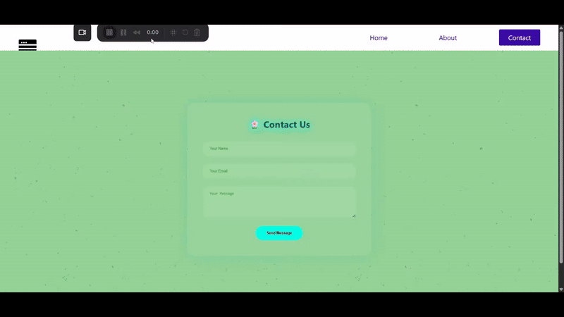

# ⚛️ React Router App

Welcome to the **React Routing Practice Project**!  
This project is built using **React**, **React Router DOM**, and **Create React App (CRA)** to demonstrate page-based navigation in a single-page application.

---

## 🌐 Live Preview



> 📸 The above demo shows smooth navigation between **Home**, **About**, and **Contact** pages using React Router.

---

## 🎯 Features

- 🔁 Client-side Routing with `react-router-dom`
- 🧭 Navigation bar using `NavLink`
- 🌈 Animated pages (Home, About, Contact)
- 🧪 Practicing component-based structure
- 💡 Minimal and clean responsive UI

---

## ⚙️ Setup Using Create React App (CRA)

This project was bootstrapped with:

```bash
npx create-react-app react-router-demo
```

React Router was added using:

```bash
npm install react-router-dom
```

---

## 📦 Tech Stack

- [React](https://reactjs.org/)
- [React Router DOM](https://reactrouter.com/en/main)
- HTML5 / CSS3
- JavaScript (ES6+)
- Create React App (CRA)

---

## 🚀 How to Run Locally

```bash
# 1. Clone this repo
git clone https://github.com/your-username/react-router-demo.git

# 2. Navigate into the project directory
cd react-router-demo

# 3. Install dependencies
npm install

# 4. Start the development server
npm start
```

---

## 🧠 Learning Purpose

This app was created as a **learning project** to get hands-on experience with **React Router**, component routing, and modular structuring in React.

---

## 🙌 Author

## Built with by \[Prasun Prabhat]
